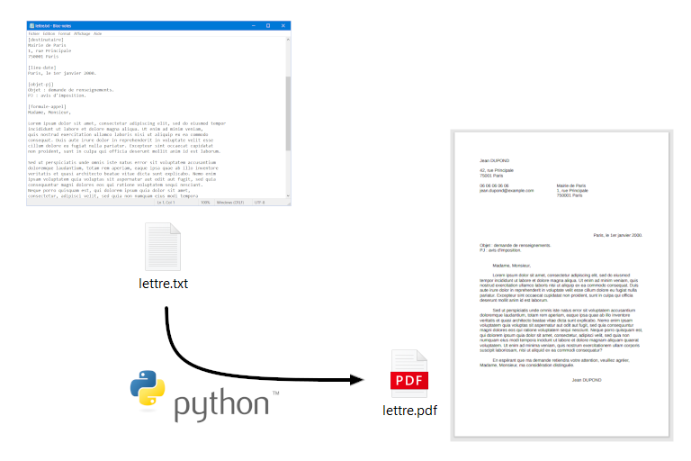

# Générateur de documents PDF - Python 3

**Objectifs**
- utiliser le langage Python (3.9) dans un projet structuré
- analyser et comprendre le standard PDF (1.4)
- générer des documents de type courrier, avec mise en page au format A4

**Principe**

**Utilisation**

Lancer le script principal : [genpdf.py](genpdf.py), avec la commande :

<pre><code>python3 genpdf.py</code></pre>

Les chemins du fichier source et du fichier de sortie sont modifiables
dans le script principal.

Un exemple de fichier source est fourni : [courrier.txt](exemple/courrier.txt).
